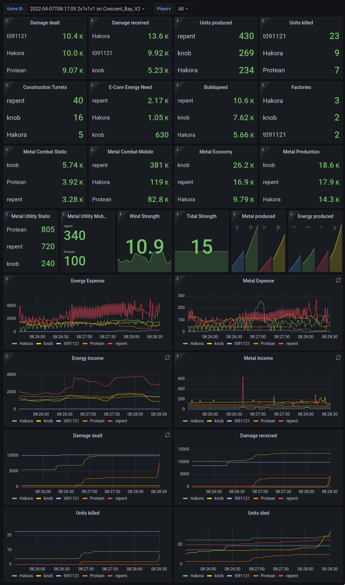

# Metrics for Beyond All Reason
## Screenshots

## Architecture
A lua widget (`metrics.lua`) exposes metrics about an on-going game on `localhost:9123` in prometheus format.
A container that contains both [Prometheus](https://prometheus.io) (to collect and summarize the data) and [Grafana](https://grafana.com) (to visualize it) can be started locally. A dashboard is included that shows some relevant data, but many metrics are not currently shown.

## Usage instructions
Copy/Link the `metrics.lua` file to your `<base>/LuaUI/Widgets` directory.

Create and run the container as follows (or see the Makefile for sample podman commands).
```bash
   docker build . -t bar-stats
   docker run --network=host bar-stats
```

Open [http://localhost:3000/d/bar](http://localhost:3000/d/bar) in your browser. Reload the page after a game has started.

## Caveat
If you run docker as `--network=host`, then every port on your local machine is accessible to the docker container, and every port in the container is accessible from outside (unless you run a properly configured firewall).
